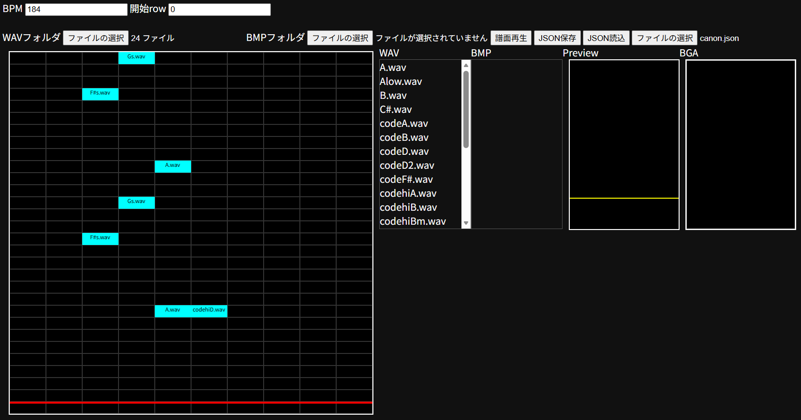

# Notes Share system in Browser(仮)

ブラウザで完結する、簡易的な演奏ゲームを作りたい。
BMSのように、ノーツとwavファイルを紐づけることで演奏感を実装します。
まだまだ開発途中ですが、大まかな基盤を作成しました。

---

## 曲データ

このプログラムに対応する曲フォルダは、
**jsonファイル、wavファイル、bmpファイル** で構成されています。

---

## エディター

こちらは、譜面作成画面になります。（対応：`editor.html`）

曲データを読み取り、そこにあるwavファイル一覧を **WAVとして表示** しています。
各ノーツにwavファイルを紐づけていきます。

左から **5個のレーン** は、プレイヤーが演奏するノーツになります。
プレイヤーがキーをたたいた時、対応する音を鳴らします。

そこから **右4つのレーン** は、バックで流す音源になります。
プレイヤーの意思にかかわらず、指定したタイミングで音を鳴らします。

最後に、一番右のレーンは **bmpファイルを設定するレーン** になります。

bmpは画像データであり、パラパラ漫画の要領で
**ミュージックビデオ（通称：BGA）** を作成することができます。

---

## 譜面データ

作成した譜面データは **jsonファイルで保存** されます。
それを曲フォルダに入れることで完成となります。

---

## 今後の展望

プレイヤーが簡単に譜面を設計し、それを音楽データとともに
**投稿・プレイできる仕組み** を作りたいと考えています。

また、**キー音（ノーツと紐づける音）なしの譜面構築** も考えており、
よりライトな方にも譜面制作を楽しんでいただきたいと思っています。

https://illustration-free.net/